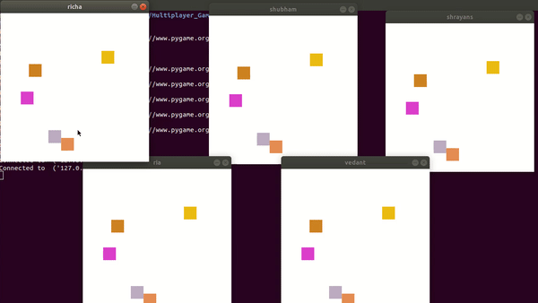

# Multiplayer_Game

1. Message Based
      a) Multiplayer game that has a server component and 4 players(client component)
      b) Each player can join multiple game at a time.
      c) Each player can make a get request to server to fetch the moves made by other player for the game currently he is a part of.
      d) Message exchanged between player and server basically comprises of two variant of messages:-
         ○ One is message from player to server containing information about his move.
         ○ Other, is from server to player containing information about all players moves
         in the current game after get request made by the player.

2. Graphic Based
   For this, I have taken the help of Tim (youtube channel tech with tim). I learned a lot from his game tutorial. 
   

